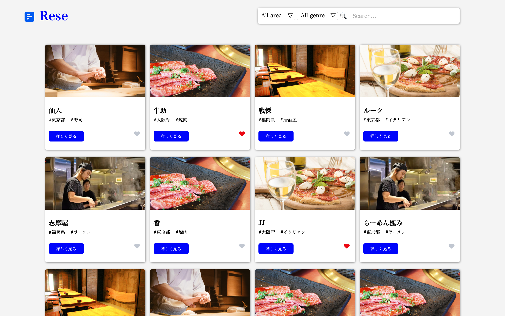
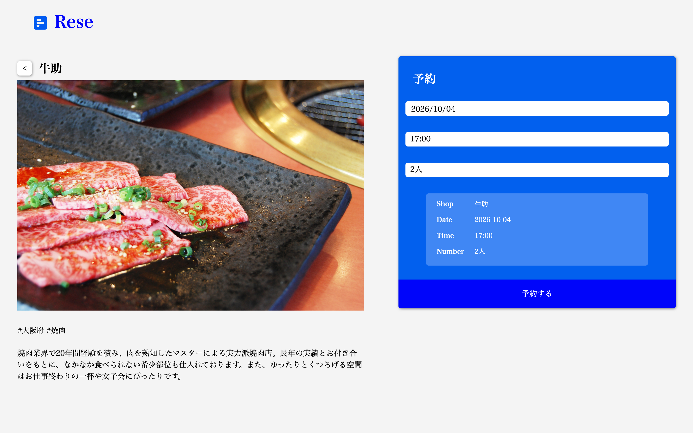
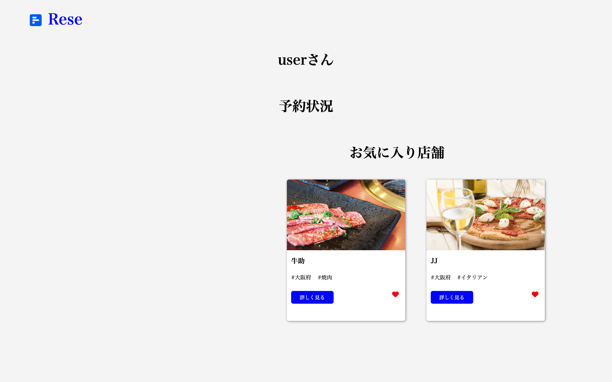
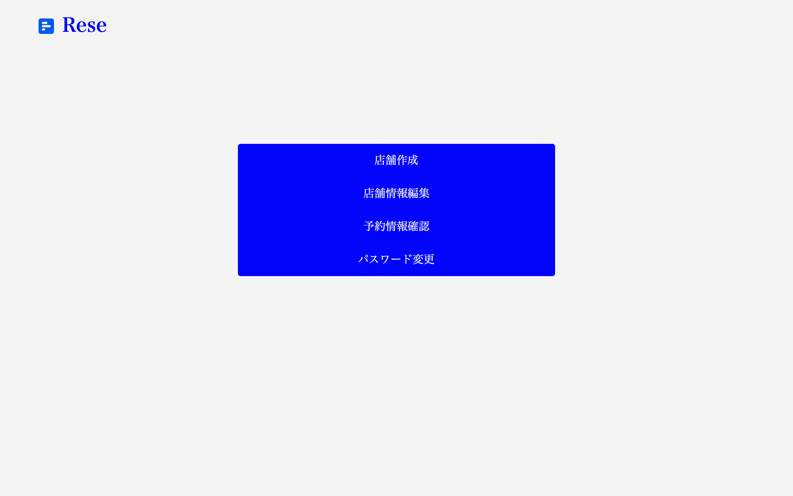
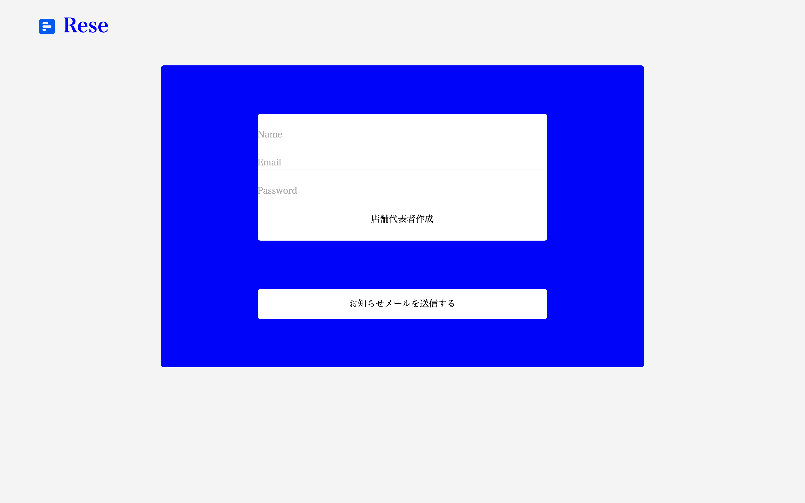
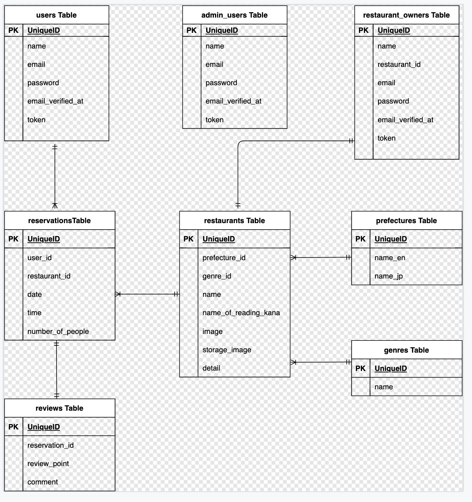

# 飲食店予約サービス Rese

## アプリ概要

飲食店の検索・予約ができる予約サービスです。外部の予約サービスに支払う手数料をなくし、自社で予約を管理することを目的に作成しました。

## 目次
- [アプリ概要](#アプリ概要)
- [画面イメージ](#画面イメージ)
- [環境構築](#環境構築)
- [使用技術](#使用技術)
- [ER図](#er図)
- [設計・実装のポイント](#設計実装のポイント)
- [URL](#url)

### 主な機能
#### 一般ユーザーができること
- 会員登録(メール認証あり) / ログイン / ログアウト
- 飲食店の検索(エリア / ジャンル / 店名)
- 飲食店のお気に入り登録
- 飲食店の予約 / 予約の変更 / 予約の削除
- 予約情報をQRコードで表示
- 飲食店の評価とコメント
- マイページで予約・お気に入りの一覧を確認

#### 店舗代表者ができること
- ログイン / ログアウト
- 店舗の作成 / 店舗情報の変更(店舗画像のアップロード)
- 店舗の予約情報の確認

#### 管理者ができること
- ログイン / ログアウト
- 店舗代表者の作成
- ユーザーへのメール送信

## 画面イメージ
### 飲食店一覧画面

### 飲食店詳細・予約画面

### マイページ

### 店舗代表者 店舗管理画面

### 管理者画面


## 環境構築

### Dockerビルド

1. git clone git@github.com:hi-san10/rese.git
2. docker-compose up -d --build

*MYSQLは、OSによって起動しない場合があるのでそれぞれのPCに合わせて docker-compose.yml ファイルを編集してください。

### Laravel環境構築

1. docker-compose exec php bash
2. composer install
3. .env.example ファイルから .env を作成し、docker-compose.ymlに応じて環境変数を変更(メールの設定は下記参照)
4. php artisan key:generate
5. php artisan migrate
6. php artisan storage:link
7. php artisan db:seed

#### シーディングされるダミーデータ
- 一般ユーザーのダミーデータ1件分
  - email: `user@mail.com` / password: `0000`
- 管理者のダミーデータ
  - email: `admin@email.com` / password: `1111`
- 店舗代表者のダミーデータ(ログイン例1件、ほか19件)
  - email: `sennin@email.com` / password: `0001`
- 店舗のダミーデータ20件分
- エリア(都道府県)のデータ47件分
- ジャンルのデータ5件分

### メール設定(Mailtrap)
開発環境ではMailtrapサービスを使ってメール機能を開発しています。

- Mailtrap url:[https://mailtrap.io](https://mailtrap.io)
- アカウント作成後、ログインする
- 左メニューにある Email Testing リンク、もしくは画面中央あたりの Email Testing の「Start Testing」ボタンをクリック
- SMTP Settings タブをクリック
- Integrations セレクトボックスで、Laravel 7.x,8.x を選択
- copy ボタンをクリックして、クリップボードに .env の情報を保存
- .envにコピーした情報を貼り付ける

```env
MAIL_MAILER=smtp
MAIL_HOST=sandbox.smtp.mailtrap.io
MAIL_PORT=2525
MAIL_USERNAME=your_mailtrap_username   # ← Mailtrap の SMTP Settings の値に置き換え
MAIL_PASSWORD=your_mailtrap_password   # ← Mailtrap の SMTP Settings の値に置き換え
MAIL_ENCRYPTION=tls

MAIL_FROM_ADDRESS=example@example.com
MAIL_FROM_NAME="${APP_NAME}"
```

.env を更新したら `php artisan config:clear` を実行してください。

## 使用技術

- PHP 7.4.9
- Laravel 8.83
- MYSQL 8.0
- Docker / Docker Compose
- Nginx
- AWS(EC2)へのデプロイを経験(現在は停止)

## ER図



## 設計・実装のポイント
- Docker環境を構築し、環境差異なく動作するよう設計
- 一般ユーザー・店舗代表者・管理者の3つの権限を分け、それぞれに必要な機能だけを提供
- 予約情報をQRコードで表示し、来店時に提示できるようにしている
- ブレイクポイントを768pxとし、タブレット・スマートフォンに対応したレスポンシブデザインを実装
- アップロードされた店舗画像はストレージに保存し、シンボリックリンク経由で表示

## URL

- アプリケーション(開発環境):[http://localhost/](http://localhost/)
- phpMyAdmin(開発環境):[http://localhost:8080](http://localhost:8080)